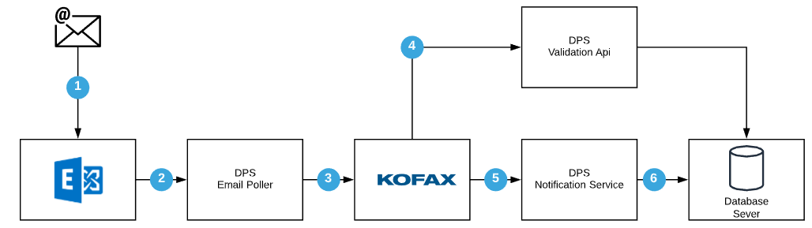

# DPS Document Processing System

DPS is used by the BC Ministry of Justice Department as an integration pipeline to process image documents.

Documents that are sent to a specific email address will be processed by DPS.

A typical DPS flow consists of the following:



1. A formated email is sent to an exchange server with an attached image.
1. DPS Email Poller read the email and extract the image(s) with some metadata.
1. KOFAX uses DPS Validation Api to validate some data with the destination database server.
1. KOFAX server uses OCR to extract data from the image documents.
1. DPS Notification service is called on OCR completion and import the extracted data to a database server.
1. Database server is updated.

## Contributing

Before you start have a look at our [CODE OF CONDUCT](CODE_OF_CONDUCT.md), we are a friendly project, so don't hesitate to give us some feedback!

If you decide to contribute, you can read our [CONTRIBUTING GUIDE](CONTRIBUTING.md).

## Project Structure

    .
    ├── .github                             # Contains GitHub Related sources
    ├── configurations                      # 
    ├── openshift                           # openshift templates and pipeline
    ├── src/                                # application source files
    │   ├── spd-notification-worker/        # SPD Notification Worker
    │   ├── dps-notification-service/       # DPS Notification service  
    │   ├── dps-validation-service/         # DPS DFCM service
    |   ├── figaro-validation-service/      # DPS Figaro Validator service
    |   ├── dps-payment-service/                 # DPS payment service
    │   └── service-api                     # DPS service api
    ├── tests                               # Tests files
    ├── docker-compose.yml                  # docker compose definition
    ├── LICENSE                             # Apache License
    └── README.md                           # This file.

## Run

Install [Docker](https://www.docker.com/)

Create a .env file based of `.env.template` and choose a password for splunk

run

```bash
docker-compose up dps-splunk
```

[login](http://localhost:8000) into splunk `admin:<your password>`

Enable splunk [Http Event Collector](https://docs.splunk.com/Documentation/Splunk/7.2.3/Data/UsetheHTTPEventCollector) and create a token

Update your .env file with the newly created token value and the figaro server information

Install [Splunk Addon for NGINX](https://splunkbase.splunk.com/app/3258/) app following this [instructions](https://docs.splunk.com/Documentation/AddOns/released/Overview/Singleserverinstall)

Restart splunk when prompted

Restart docker-compose with the new changes

```bash
docker-compose up --build -d
```

## Dps Service List

| Name | Doc | Notes | Swagger |
| --- | --- | --- | --- |
| Payment Service | [Doc](src/dps-payment-service/README.md) | [payment-service.swagger.yml](docs/payment-service.swagger.yml) |
| CRRP Notification Worker| [Doc](src/crrp-notification-worker/README.md) | |
| DPS Notification Service| [Doc](src/dps-notification-service/README.md) | |
| DPS Validation Service | [Doc](src/dps-validation-service/README.md) | |
| Figaro Validation Service | [Doc](src/figaro-validation-service/README.md) | |
| VIPS Notification Worker| [Doc](src/vips-notification-worker/README.md) | |

## Endpoints

| URL                                                                                                                                              | Method | Description |
|--------------------------------------------------------------------------------------------------------------------------------------------------| --- | --- |
| **Payment Service**                                                                                                                              | --- | --- |
| [http://localhost:5050/paymentservice/bamboraconfiguration](http://localhost:5050/paymentservice/bamboraconfiguration)                           | GET | Bambora configuration url |
| [http://localhost:5050/paymentservice/getSinglePaymentURL](http://localhost:5050/paymentservice/getSinglePaymentURL)                             | GET | Single Payment Url |
| [http://localhost:8081/paymentservice/actuator/health](http://localhost:8084/paymentservice/actuator/health)                                     | GET | Payment Service Health |
| [http://localhost:8081/paymentservice/swagger-ui.html](http://localhost:8084/paymentservice/swagger-ui.html)                                     | GET | Figaro Validator Swagger-UI |
| [http://localhost:8081/paymentservice/v2/api-docs](http://localhost:8084/paymentservice/v3/api-docs)                                             | GET | Figaro Validator Api docs |
| **Figaro Validation**                                                                                                                            | --- | --- |
| [http://localhost:5050/figvalidationservice/locateMatchingApplicants](http://localhost:5050/figvalidationservice/locateMatchingApplicants)       | GET | Locate Matching Applicants |
| [http://localhost:5050/figvalidationservice/validateApplicantService](http://localhost:5050/figvalidationservice/validateApplicantService)       | GET | Validate Applicant Service |
| [http://localhost:5050/figvalidationservice/validateApplicantForSharing](http://localhost:5050/figvalidationservice/validateApplicantForSharing) | GET | Validate Applicant Sharing |
| [http://localhost:5050/figvalidationservice/validateApplicantPartyId](http://localhost:5050/figvalidationservice/validateApplicantPartyId)       | GET | Validate Applicant Party ID |
| [http://localhost:8082/figvalidationservice/actuator/health](http://localhost:8082/figvalidationservice/actuator/health)                         | GET | Figaro Validator Health | 
| [http://localhost:8082/figvalidationservice/swagger-ui.html](http://localhost:8082/figvalidationservice/swagger-ui.html)                         | GET | Figaro Validator Swagger-UI |
| **DPS Validation**                                                                                                                               | --- | --- |
| [http://localhost:5050/dpsvalidationservice/getValidOpenDFCMCase](http://localhost:5050/dpsvalidationservice/getValidOpenDFCMCase)               | GET | Valid Open DFCM Case |
| [http://localhost:8083/dpsvalidationservice/actuator/health](http://localhost:8083/dpsvalidationservice/actuator/health)                         | GET | DPS Validation Service Health | 
| [http://localhost:8083/dpsvalidationservice/swagger-ui.html](http://localhost:8083/dpsvalidationservice/swagger-ui.html)                         | GET | DPS Validation Service Swagger-UI |
| [http://localhost:8083/dpsvalidationservice/v2/api-docs](http://localhost:8083/dpsvalidationservice/v3/api-docs)                                 | GET | DPS Validation Service Swagger |
| **DPS Output Notification**                                                                                                                      | --- | --- |
| [http://localhost:5054/dpsnotificationservice/actuator/health](http://localhost:5054/dpsnotificationservice/actuator/health)                     | GET | DPS Notification Service Health |
| [http://localhost:5050/ws/dpsOutputNotification.wsdl](http://localhost:5050/ws/dpsOutputNotification.wsdl)                                       | GET | DPS Output Notification Service WSDL |
| **CRRP Notification Worker**                                                                                                                     | --- | --- |
| [http://localhost:5055/crrpnotificationworker/actuator/health](http://localhost:5054/crrpnotificationworker/actuator/health)                     | GET | CRRP Notification 
| **CRRP Notification Worker**                                                                                                                     | --- | --- |
| [http://localhost:5056/vipsnotificationworker/actuator/health](http://localhost:5056/vipsnotificationworker/actuator/health)                     | GET | CRRP Notification 


Worker Health |
| **SUPPORT APPS** | --- | --- |
| [RabbitMq](http://localhost:15672) | Rabbit MQ management console | --- |
| [Splunk](http://localhost:8000) | Splunk Web | --- |


## Versioning

We use [SemVer](http://semver.org/) for versioning. For the versions available, see the [release on this repository](https://github.com/bcgov/bcparis-service/releases). 

### Update Version

Run

```
mvn versions:set -DartifactId=*  -DgroupId=*
```

## Tests

### Postman

We maintain a [postman collection](tests/postman/DPS-Service-Api.postman_collection.json) and a [postman environment](tests/postman/dps-env.postman_environment.json).

You can also run the collection using [newman](https://www.npmjs.com/package/newman)

Install newman as a global tool

```bash
npm install -g newman
```

Run the collection

```bash
cd tests/postman
newman run DPS-Service-Api.postman_collection.json -e dps-local-env.postman_environment.json
```

Run the collection with datafile

DPS Validation Service

```bash
cd tests/postman
newman run DPS-Service-Api.postman_collection.json -e dps-local-env.postman_environment.json -d get-valid-open-dfcm-case-datafile.json
```
Fig validation service

```bash
 newman run DPS-Service-Api-Fig.postman_collection.json -e dps-local-env.postman_environment.json -d fig-locate-matching-applicants-datafile.json
 ```
 